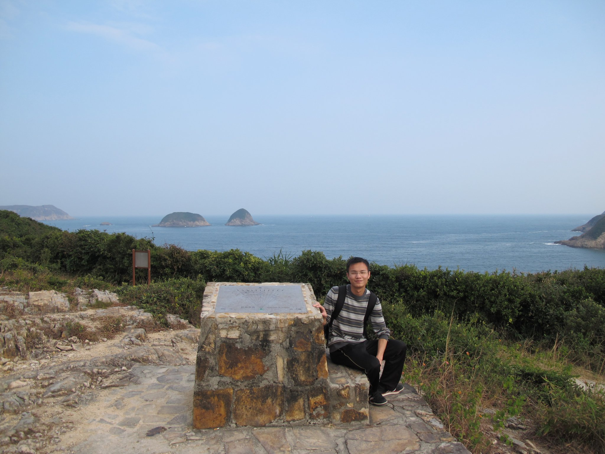

[//]: 

[//]: 

# Shuai Zha (查帥)

I am a theoretical astrophysics, mainly working on the computational modeling of supernovae. Currently I am a prize postdoc at Tsung-Dao Lee Institute, Shanghai Jiaotong University. 
email: szha.astrop@gmail.com

I have made contributions to the prediction of multi-messenger signals that can imprint the hadron-quark phase transition in core-collapse supernovae. I also actively work on the modeling of electron-capture supernovae, from progenitor evolution to explosions. For my detailed research interest, please refer to the [research](joshuashzha.github.io/research/) page.

I was born in Anhui province, China, which is famous for the beautiful [Yellow Mountain](https://www.chinahighlights.com/huangshan/yellow-mountain/).

photo: taken by an old friend Shantao Li at Saikong Beach, Hong Kong in 2010, which is one of my best memories.

